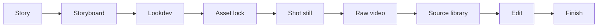

# Cinema Studio Pipeline v2

Higgsfield Cinema Studio와 Seedance를 중심으로 스토리 설계부터 원본 소스,
편집, 납품까지 이어 주는 파일 기반 AI 영화 제작 스킬이다. 채팅 기억이나 모델의
성공 메시지보다 승인된 결과물, 실제 설정, 해시, 원본 계보를 우선한다.

실행 규칙은 `SKILL.md`, 기계 계약은 `schemas/`, 사람이 채우는 시작점은
`templates/`, 단계별 제작법은 `workflows/`에 나뉘어 있다.

## 핵심 동작



각 단계는 같은 순서를 따른다.

1. 현재 `project.json`과 관련 레코드를 검증한다.
2. 가장 먼저 막힌 게이트 하나만 고른다.
3. 검토 가능한 결과물 하나를 만든다.
4. 결과물과 설정을 저장하고 SHA-256을 기록한다.
5. 고정 경로 Story/Storyboard/Lookdev/Shot/Source라면 current 파일과 모든 파일 증거를
   불변 `history/<subject-id>/vNNN/` 스냅샷으로 보존한다. Asset/Take는 media를 subject로,
   해당 `asset.json`/`take.json`을 해시 증거로 묶고 검토 요청 시점부터 둘 다 고정한다.
6. current/archive 경로와 동일 해시를 중앙 승인 증거에 함께 넣고, 승인 레코드를
   `USER_REVIEW_REQUIRED`로 바꿔 사용자에게 그 정확한 바이트를 보여 준다.
7. 사용자가 승인하면 content 파일은 바꾸지 않고 중앙 승인만 `USER_APPROVED`로
   결정한다. 그 exact-hash 승인이 생길 때까지 다음 단계로 가지 않는다.

수정된 결과물은 새 해시이므로 과거 승인을 승계하지 않는다.

## 세 가지 제작 모드

| 모드 | 용도 | 편집 시점 |
| --- | --- | --- |
| `RAW_SOURCE_FIRST` | 원본 소스를 모두 확보한 뒤 편집 | 소스 라이브러리 승인 후 |
| `ASSEMBLY_WHILE_GENERATING` | 편집 조립본이 부족한 커버리지를 되돌려 요청 | 승인된 소스가 생길 때마다 |
| `CONCEPT_EXPLORATION` | 빠른 룩·아이디어 탐색 | 제작 원본으로 자동 승격하지 않음 |

기본값은 `RAW_SOURCE_FIRST`다. 사용자가 결과를 먼저 보고 합격한 소스만 모은 뒤
편집하고 싶을 때 이 모드를 사용한다.

## 두 가지 실행 방식

### Guided mode

사용자와 이야기하면서 선택지를 좁히되, 확정된 내용은 모두 JSON 권한 레코드에
기록한다. 질문과 승인 요청은 현재 게이트에 필요한 것만 한다.

### JSON mode

미리 작성한 `project.json`, 프로젝트 전체 `storyboard.json`, `shot.json`, `take.json`,
`timeline.json`, `delivery.json`을 검증한 뒤 그대로 실행한다. 영상 파일 여러 개의
배치, 인·아웃 프레임, 컷 위치, 오디오 이벤트, 전환 의도는 `timeline.json`으로 표현한다.

JSON 모드는 특정 편집기의 비공개 프로젝트 파일과 같다는 뜻이 아니다. 기본 내보내기는
검증 가능한 편집 결정 목록이다. CapCut 내부 프로젝트에 직접 이식하려면 해당 버전의
포맷을 별도 어댑터로 검증해야 하며, 그 검증 전에는 “CapCut 호환”이라고 표시하지 않는다.

## 샷 생성 방식

| 방식 | 주 입력 | 적합한 경우 |
| --- | --- | --- |
| `REFERENCE_TEXT_NATIVE` | 승인된 참조와 구조화 프롬프트 | 일반적인 이미지-투-비디오 샷 |
| `BOUNDARY_FRAME` | 승인된 시작·끝 프레임 | 시작과 끝의 구도가 모두 서사적으로 중요할 때 |
| `MOTION_REFERENCE` | 모션 참조 | 특정 동작의 리듬과 궤적이 중요할 때 |
| `MUSIC_LIPSYNC` | 오디오와 연기 계약 | 대사, 노래, 입 모양 동기화가 필요할 때 |

한 샷에는 한 방식을 명시한다. 참조 역할이 겹치거나 서로 다른 상태를 동시에 요구하면
생성 전에 검증기가 차단한다.

### Seedance에 스토리보드 함께 넣기

Seedance의 현재 활성 모델이 멀티모달 레퍼런스를 지원하면, 승인된 러프 스토리보드를
텍스트 설명만으로 뒤집히기 쉬운 동선·인물 접촉·문 통과·소품 전달·카메라 축을 고정하는
구조 참조로 함께 넣는 방식을 우선한다.

러프 보드는 실제 첫 프레임이나 최종 미술 참조가 아니며 기존 샷 생성 방식을 바꾸지
않는다. `BOUNDARY_FRAME`은 승인된 시작·끝 프레임을, `REFERENCE_TEXT_NATIVE`는
완성 시작 프레임 없이 역할별 자산을 사용한다. 모션·오디오 방식도 각자 필수 입력을
유지한다. 주석 보드는 시작/끝, 정체성, 의상·상태, 장소, 재질·조명, 소품 역할로 쓰지
않고, 별도 승인된 깨끗한 파생본만 스타일 역할로 쓸 수 있다. 프롬프트에는 보드의 패널
테두리, 글자, 화살표, 범례, 고스트 실루엣, 연필선, 흑백 스타일을 결과 픽셀에 복제하지
말라고 명시한다.

정확한 구조 참조 경로·해시 바인딩이 스키마에 추가되기 전에는 임의로 자른 보드 대신
승인된 원본 패널만 사용한다. 모든 이미지 입력을 하나의 제공자 한도에 합산하며, 한도가
부족하면 방식상 필수인 경계 프레임과 정체성·상태·장소 입력을 선택적 보드보다 우선한다.

복수 인물의 자리·시선·교차·가림·깊이 순서가 자꾸 무너지면 `timed-storyboard`의 선택적
production-control 출력을 사용한다. 사람이 확인하는 라벨/화살표 지도와 모델에 넣는
무문자·무스타일 클린 지도를 분리하며, 둘 다 승인된 보드 좌표에서 파생한다. 이 지도는
새 생성 방식이나 정체성·의상·장소·조명 참조가 아니고 구조만 전달한다.

## 권한 레코드

| 파일 | 책임 |
| --- | --- |
| `project.json` | 실행·제작 모드, 현재 단계, 게이트, 권한 경로 |
| `asset.json` | 캐릭터·의상·장소·소품 한 버전의 정체성, 상태, 원본 계보 |
| `storyboard.json` | 승인된 Story 의존성, `asset_plan`, `scenes[].panels`, `shot_plan.coverage_requirements` |
| `shot.json` | 한 샷의 목적·연출·정확한 커버리지 ID와 Story/Board/Look/Asset 승인 스냅샷 |
| `take.json` | 실제로 충족한 `coverage_requirement_ids`, 모델·UI 설정·입력 해시·출력·판정 |
| `approval.json` | `09_approvals/`의 중앙 승인: 대상 ID·해시, 사용자 증거, 시각 |
| `timeline.json` | 컷·이벤트와 승인 전 확정한 `PICTURE_LOCKED`; 중앙 승인이 잠금을 효력화 |
| `delivery.json` | 잠긴 타임라인, 렌더 마스터, 파생 설정, `media_integrity: PASS`와 QA 증거의 한 버전 |

승인의 `subject_id`와 `subject_sha256`은 아래 실제 권한을 가리킨다.

| Subject | `subject_sha256` 대상 | 필수 evidence / 보존 방식 |
| --- | --- | --- |
| Story | 현재 Story Markdown | current/archive pair; fixed history |
| Storyboard | 현재 `storyboard.json` | JSON + 모든 panel pixels의 current/archive pairs; fixed history |
| Lookdev | 현재 Visual Bible Markdown | Markdown + board/panel 증거 pairs; fixed history |
| Asset | immutable master media | exact master + immutable `asset.json` evidence + current Visual Bible |
| Shot still | 현재 `shot.json` | JSON + 모든 still/boundary pixels의 pairs; fixed history |
| Take | immutable output media | exact output + immutable `take.json` + input/provenance evidence |
| Source library | 현재 `source_manifest.json` | manifest + admitted source pairs; fixed history |
| Timeline | 현재 timeline record | exact record + source manifest; record path 자체가 versioned immutable |
| Delivery | 현재 delivery record | record + export master + 모든 QA evidence; versioned immutable |

중앙 승인과 프로젝트 게이트의 공통 검토 상태는 다음 여덟 개만 사용한다.

`DRAFT`, `INTERNAL_REVIEW`, `USER_REVIEW_REQUIRED`, `USER_APPROVED`,
`REJECTED`, `SUPERSEDED`, `EXCLUDED_FROM_INPUTS`, `LEGACY_UNVERIFIED`

production subject 9종(Story, Storyboard, Lookdev, Asset, Shot, Take, Source, Timeline, Delivery)은
content record에 top-level `review_status`나 `approval_id`를 갖지 않는다. `USER_APPROVED`는 사용자와
현재 파일 해시를 증명하는 중앙 승인 레코드에만 존재한다. `SOURCE_LOCKED`와
`PICTURE_LOCKED`는 승인 전에 content에 기록하는 고정 의도이며, 그 자체는 승인이 아니다.
`INTERNAL_REVIEW` 이후의 결정 상태는 non-null subject hash와 실제 hashed evidence를
요구한다. `DRAFT`와 `LEGACY_UNVERIFIED`만 null 패키지를 허용한다.

### 중앙 검토 CLI

첫 검토 요청은 다음 CAS 명령으로 만든다.

```powershell
python scripts/prepare_review.py <project-root> <SUBJECT_TYPE> <subject-id> --requested-by <actor> --expected-project-sha256 <sha256> --expected-subject-sha256 <sha256> --apply
```

사용자가 실제 결과를 본 뒤 승인 또는 거절을 기록한다.

```powershell
python scripts/record_decision.py <project-root> <approval-id> <approve|reject> --actor <actor> --expected-project-sha256 <sha256> --expected-approval-sha256 <sha256> --expected-subject-sha256 <sha256> [--reference <user-evidence>] [--notes <reason>] --apply
```

두 명령은 명시한 project/subject/approval SHA가 현재 바이트와 정확히 일치할 때만 쓴다.
`approve`에는 사용자가 본 증거를 가리키는 `--reference`, `reject`에는 이유를 담은
`--notes`가 필수다.
최종 승인·거절은 프로젝트 밖의 machine-local authenticated decision receipt에도 결속된다.
프로젝트를 다른 PC나 경로로 이동·가져오면 이 결속은 무효가 되므로 재승인하거나 명시적인
receipt migration workflow를 사용해야 한다. receipt나 비밀 키 파일을 복사하거나 직접 고치지 않는다.
이 보증의 경계는 프로젝트 트리만 조작할 수 있는 행위자다. 같은 OS 사용자 권한으로
machine-local key/receipt 저장소까지 수정할 수 있는 행위자를 막으려면 별도의 OS 보호 서비스가 필요하다.
다중 파일 전이의 원자성은 공통 transition lock을 사용하는 동봉 도구 사이에서 보장한다.
같은 권한의 임의 외부 writer까지 휴대 가능한 파일시스템 CAS 하나로 통제할 수는 없다.
`init_project.ps1`은 bootstrap/rebuild 작업이므로 검토·결정·상태 전이 도구와 동시에 실행하지 않는다;
이 초기화 명령은 shared-lock 동시 실행 보증의 범위에 포함되지 않는다.
현재 구현의 `prepare_review.py`는 같은 subject ID에 대한 첫 current review만 지원한다.
`E_REVISION_WORKFLOW_UNSUPPORTED`가 나오면 파일이나 기존 승인을 수동으로 고치지 말고
고정-path 또는 versioned-record revision workflow를 사용한다. Asset/Take는 검토 요청 후
record와 media를 수정하지 않으며, 변경 후보는 새 `asset_id`/`take_id`로 만든다.

### 고정 경로 승인 스냅샷

Story, Storyboard, Lookdev, Shot, Source는 current authority 경로를 유지하되 검토 요청 전에 다음
미사용 `vNNN`을 만든다.

| 대상 | 불변 authority snapshot |
| --- | --- |
| Story | `01_story/history/story-contract/vNNN/STORY_CONTRACT.md` |
| Storyboard | `02_storyboard/history/<storyboard-id>/vNNN/storyboard.json` |
| Lookdev | `03_lookdev/history/visual-bible/vNNN/VISUAL_BIBLE.md` |
| Shot still | `05_shots/<shot-id>/history/vNNN/shot.json` |
| Source library | `06_source_library/history/<library-id>/vNNN/source_manifest.json` |

그 밖의 패널·스틸·소스·선행 파일 증거는 각 버전의
`evidence/<original-project-relative-path>` 아래에 같은 바이트로 복사한다. 승인에는
current와 archive 양쪽 경로 및 같은 SHA-256을 모두 기록한다. 고정 파일을 교체하기
전에 기존 승인의 서로 다른 모든 evidence SHA가 실제 history 파일 하나 이상으로
검증되어야 한다.

재검토 때 successor approval을 먼저 `DRAFT`로 만들고 `supersedes_approval_id`를
채운다. 고정 5종의 기존 `USER_APPROVED`만 current 교체 때 대상·증거·사용자·결정
시각을 바꾸지 않은 채 `SUPERSEDED`와 `superseded_by_approval_id`를 기록한다.
`REJECTED` 후보는 history 바이트와 거절 상태를 유지하고 successor link만 받는다.
Timeline/Delivery도 `USER_REVIEW_REQUIRED`부터 해당 record path가 불변이다. 다음 후보는
새 versioned path에 만들고, terminal predecessor 승인(`USER_APPROVED` 또는 `REJECTED`)의
결정 상태는 유지한 채 reciprocal replacement link를 연결한다.

Asset/Take는 고정 current 파일을 교체하는 revision 대상이 아니다. 중앙 검토가
`USER_REVIEW_REQUIRED`에 들어간 순간 media subject와 함께 해시된 record evidence도
불변이다. 승인·거절·제외 뒤 다른 설정이나 메타데이터가 필요하면 새 ID의 candidate를
만들고 별도 중앙 승인을 요청한다. Take의 편집 소스 채택 여부는 `take.json` 필드가
아니라 승인된 `SOURCE_LOCKED` manifest membership으로만 표현한다.

자산·샷 스틸·원본 영상은 컬렉션 게이트다. ASSET_LOCK은 승인된 `asset_plan`의 모든
항목에 현재 승인 자산이 있을 때, SHOT_STILL은 `shot_plan`의 모든 샷에 현재 승인
`shot.json`과 픽셀 증거가 있을 때, RAW_VIDEO는 모든 `coverage_requirements`의
`minimum_approved_takes`가 충족될 때만 닫힌다. 그 밖의 후보 레코드도 각각
중앙 결정 `REJECTED`, `SUPERSEDED`, `EXCLUDED_FROM_INPUTS`로 정리하며 승인을 하나로 뭉개지 않는다.

## 권장 프로젝트 구조

```text
project-root/
├─ project.json
├─ 00_schemas/               # 이 프로젝트가 시작될 때의 v2 계약 스냅샷
├─ 01_story/
│  ├─ STORY_CONTRACT.md
│  └─ history/story-contract/vNNN/{STORY_CONTRACT.md,evidence/...}
├─ 02_storyboard/
│  ├─ storyboard.json
│  ├─ panels/<panel-id>.png
│  └─ history/<storyboard-id>/vNNN/{storyboard.json,evidence/...}
├─ 03_lookdev/
│  ├─ VISUAL_BIBLE.md
│  └─ history/visual-bible/vNNN/{VISUAL_BIBLE.md,evidence/...}
├─ 04_assets/
│  ├─ asset-index.json
│  └─ records/<asset-id>/asset.json
├─ 05_shots/
│  └─ <shot-id>/
│     ├─ shot.json
│     ├─ history/vNNN/{shot.json,evidence/...}
│     └─ takes/<take-id>/take.json
├─ 06_source_library/
│  ├─ source_manifest.json
│  └─ history/<library-id>/vNNN/{source_manifest.json,evidence/...}
├─ 07_edit/
│  ├─ timeline.json          # 초기 v001 권한 레코드
│  └─ records/<timeline-id>/v###/timeline.json
├─ 08_delivery/
│  ├─ delivery.json          # 초기 v001 권한 레코드
│  └─ records/<delivery-id>/v###/delivery.json
├─ 09_approvals/
└─ 99_logs/
```

원본 미디어는 덮어쓰지 않는다. 보정본과 편집본은 부모 원본의 해시를 가리키는
파생 결과물이다. 편집된 이미지를 다시 정체성 마스터로 넣는 순환 계보는 금지한다.
중앙 검토가 요청된 납품 레코드도 덮어쓰지 않는다. 승인·거절 뒤 재렌더는 고유 버전 경로에 저장하고
`supersedes_delivery`를 채운 뒤 `project.authority_files.delivery_record`를 전진시킨다.
검토된 타임라인을 다시 편집할 때도 새 버전 경로와 `supersedes_timeline`을 만들고
`project.authority_files.timeline`을 전진시킨 뒤 EDIT/FINISH 승인을 다시 받는다.
`00_schemas/`는 프로젝트를 만든 시점의 계약 스냅샷이다. 검증기는 설치된 신뢰
매니페스트와 스냅샷 해시를 먼저 비교하고, 허용되지 않은 외부 `$ref`를 거부한다.
스키마 버전 변경은 명시적 마이그레이션으로만 수행한다.

## 참조 역할

`shot.json.active_assets`의 모든 입력은 아래 역할 중 하나를 가져야 한다.

- `IDENTITY`, `WARDROBE`, `STATE`, `LOCATION_GEOMETRY`, `MATERIAL_LIGHT`
- `PROP_FUNCTION`, `MOTION`, `AUDIO`, `STYLE`

스토리보드 블로킹은 `storyboard_panel_ids`, 시작·끝 프레임은 `boundary_frames`에
기록한다. 이 구조 입력을 `active_assets` 역할로 다시 중복하지 않는다.

같은 속성을 서로 다르게 통제하는 참조 두 개는 동시에 활성화하지 않는다. 예를 들어
무기 수납/전개, 의상 A/B, 깨끗함/피투성이, 문 열림/닫힘은 별도 상태로 만든다.

## 음악 컷과 스토리보드

스토리보드는 감정과 행동의 원인, 공간 축, 시선, 동선을 설계한다. 음악 분석은
트랜지언트 밀집 구간과 컷 후보 시점을 제안한다. 둘은 독립 모듈이며 마지막에
`timeline.json`에서 합친다.

비트 후보는 자동 가속이나 무조건적인 컷 허가가 아니다. 사용자가 준 “4~6초쯤” 같은
시간은 탐색 힌트로 사용하고, 실제 트랜지언트와 프레임 주소를 확인해 컷을 제안한다.
원본 영상의 속도는 명시적인 편집 결정 없이는 바꾸지 않는다.

`storyboard.json`은 한 씬 메모가 아니라 프로젝트 전체 제작 인벤토리다.
`story_dependency`가 승인된 Story 경로·해시를, `scenes[].panels`가 행동·카메라와
`image_file`/`image_sha256` 픽셀 증거를, `asset_plan`이 이후 제작할 자산을,
`shot_plan.coverage_requirements`가 필수 샷·자산·최소 승인 테이크 수를 정한다.
자산/샷/테이크 컬렉션 게이트는 이 승인된 목록과 정확히 대조한다.

## Higgsfield 경계

- 모델 이름, 입력 개수, 해상도, 길이, 요금, UI 옵션은 변경 가능한 서비스 상태다.
- 생성 전 `providers/higgsfield/capabilities.yaml`의 확인 시각과 실제 UI를 비교한다.
- Higgsfield 프로젝트·폴더·Element·작업이 실제로 보일 때만 원격 식별자를 기록한다.
- 프롬프트에 이름을 썼다는 이유만으로 Element가 연결됐다고 간주하지 않는다.
- 캐릭터 일치 여부는 얼굴 클로즈업, 중경, 전신, 어려운 빛과 움직임에서 테스트한다.

## 검증과 실패 원칙

검증은 스키마 문법만 보는 것이 아니다. 다음을 함께 막는다.

- 선행 게이트를 건너뛴 승인
- 현재 해시와 맞지 않는 승인
- 거절·폐기·레거시 미확인 입력 사용
- 서로 배타적인 참조 상태의 동시 활성화
- 원본 대신 편집 파생본을 생성 입력으로 재사용
- 보이지 않는 원격 Element나 설정을 확인했다고 주장
- 승인되지 않은 소스를 편집 타임라인에 삽입
- Storyboard 계획과 다른 샷·자산·커버리지 ID 또는 오래된 `dependency_snapshot`
- `PICTURE_LOCKED`이지만 exact current hash의 중앙 검토/승인이 없는 타임라인
- `media_integrity: PASS`나 실제 FIRST/MIDDLE/LAST 프레임 증거가 없는 납품

전체 변경 전파와 불변 버전 규칙은 `references/12-invalidation-and-revisions.md`의
행렬을 따른다.

검증 명령과 오류 코드는 `SKILL.md`의 **Deterministic tools**와 각 스크립트의
`--help`를 기준으로 한다.

Python 도구의 명시적 의존성은 `requirements.txt`에 있다.

```powershell
python install.py --no-law-mcp --skills cinema-studio-pipeline
python -m pip install -r skills/cinema-studio-pipeline/requirements.txt
```

설치된 단일 스킬 폴더에서 의존성만 설치할 때는 다음을 사용한다.

```powershell
python -m pip install -r requirements.txt
ffmpeg -version
ffprobe -version
```

미디어 검사와 프레임 추출에는 신뢰 가능한 절대 경로나 안전한 PATH에서 찾은 FFmpeg/ffprobe가 필요하다.
프로젝트 현재 폴더의 동명 실행 파일은 사용하지 않는다. 도구가 없으면 스크립트는
성공을 가장하지 않고 구조화된 오류로 멈춘다.

## v1 자료의 취급

기존 장문 코스와 예전 제작 문서는 삭제하지 않았지만 교육용 아카이브다. v2 실행은
항상 현재 `SKILL.md`와 `workflows/`에서 시작한다. 같은 이름으로 남아 있는
`.agents/skills/cinema-studio-pipeline`은 구버전을 실행하지 않고 canonical 스킬로
위임하는 호환 셸이다.

## 범위 밖

- 사용자의 명시적 승인 없이 원격 게시·삭제·결제하지 않는다.
- 확인하지 않은 모델 파라미터나 서비스 기능을 사실로 고정하지 않는다.
- 특정 편집기 호환을 실제 왕복 테스트 없이 보장하지 않는다.
- 저작권·초상권·음원 권리를 우회하는 방법을 제공하지 않는다.
