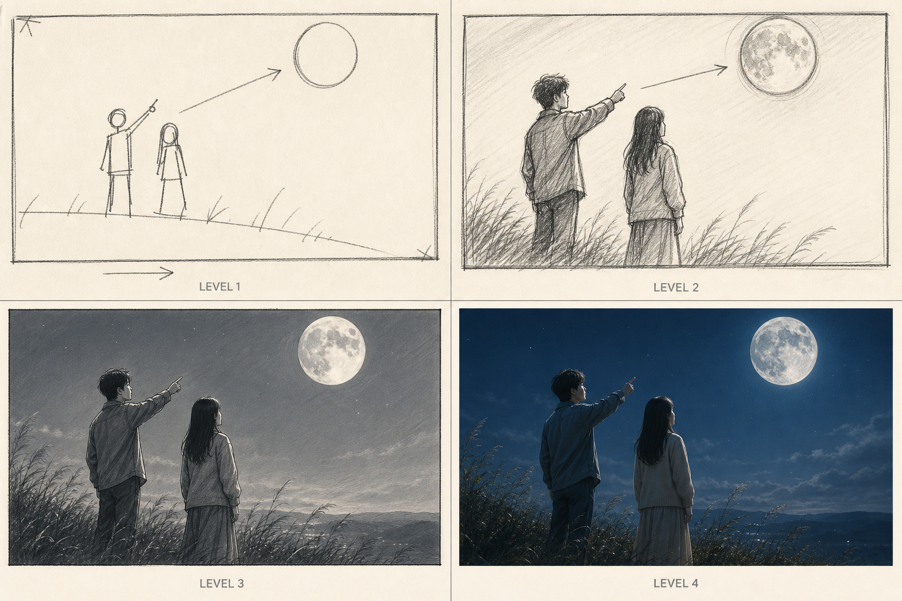

# Storyboard roughness levels

Use the same story, framing, blocking, and timing when comparing levels. Change only visual fidelity.

## Level 1 - Thumbnail rough

Use for rapid sequence and composition decisions.

- Draw stick figures, blocks, horizon, primary prop, framing box, and essential arrows only.
- Show screen direction and subject placement.
- Exclude facial acting, clothing detail, material rendering, and final lighting.
- Prefer many fast alternatives over one polished panel.

Pass when another person can identify subject, action direction, camera size, and next cut.

## Level 2 - Initial rough storyboard

Use as the default approval board.

- Draw recognizable characters, environment, major props, action, and camera angle.
- Preserve construction lines, loose graphite or charcoal marks, and simple value grouping.
- Add ghost positions, action arrows, camera arrows, gaze lines, and concise time labels.
- Show simple facial direction without polishing identity.

Pass when action, geography, timing, path, and emotional intention are readable without the prompt.

## Level 3 - Detailed production storyboard

Use for production handoff and complex staging.

- Refine anatomy, perspective, lens feel, clothing folds, light direction, spatial depth, and contact points.
- Keep the image clearly illustrated and grayscale unless color carries story information.
- Retain production annotations and path overlays in an annotated version.
- Separate panels when a single image cannot show a path or action change clearly.

Pass when a cinematographer, animator, or AI video operator can reproduce the blocking and camera move.

## Level 4 - Concept still

Use as a final visual target, not as the only storyboard evidence.

- Create a clean photoreal or selected final-style frame at the intended crop.
- Preserve a clean version without arrows or labels.
- Create a companion annotated motion card using the same composition.
- Do not allow final polish to hide unresolved blocking or continuity.

Pass when the clean still establishes the final visual promise and the companion card still explains motion precisely.

## Mixed-level projects

Allow a default project level and per-shot overrides. Use Level 2 for the whole sequence, then promote only difficult or visually decisive shots to Level 3 or 4. Never let an override silently change composition, character position, or timing.
